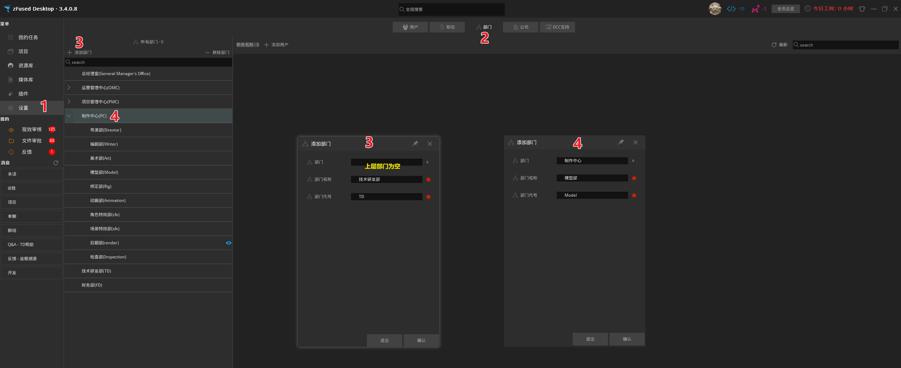
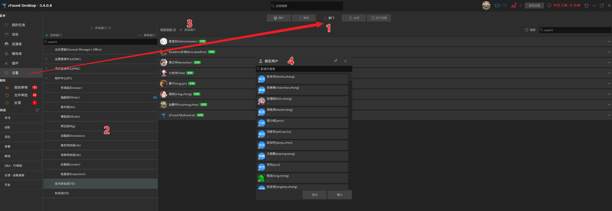

公司人员组织架构设置，后续方便创建部门群组，统一添加到环节制作人员中等

## 创建部门
1. 点击`设置`栏
2. 选择`部门`
3. 新建顶层部门，点击`添加部门`，填写`部门名称`与`部门代号`，点击`确认`即可创建出一个新的顶层部门
4. 新建下级部门，可以选中部门点击`添加部门`，新的部门将会创建为被选中部门的下级部门

## 部门人员
1. 选择`设置` - `部门`
2. 选择对应部门
3. 点击`添加用户`
4. 在弹出界面中搜索用户，支持中英文关键字搜索，支持多选用户，选择后点击`确认`将人员添加到该部门

## 环节添加部门人员
部门人员设置完善后，可以快速将部门人员批量添加到项目中
1. 选择`项目` - `设置` - `项目成员`
2. 筛选项目环节，以模型为例
3. 点击`添加所有用户` - `按部门`，选择`模型部`，即可将模型部门的所有成员添加到该环节中，项目成员同理在面板下方设置  

