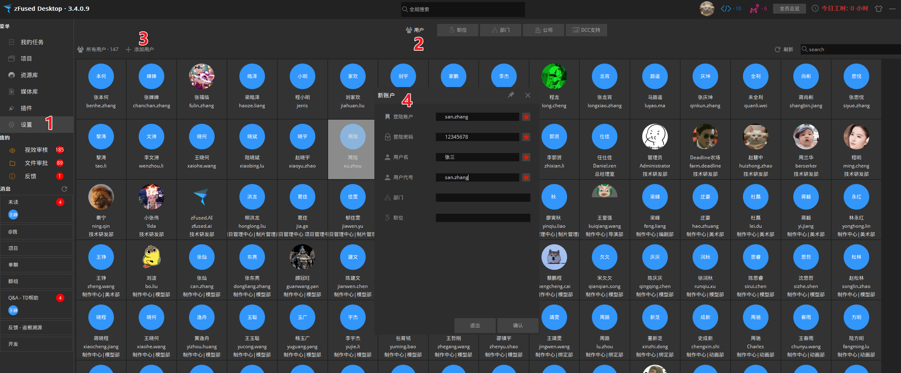

zFused账户用于登录软件，绑定项目任务信息等

## 账户创建
创建首个账号需要使用超级管理员账号，后续使用制片账户创建即可，登陆账户文本不可以重复

1. 点击`设置`栏
2. 选择`用户`
3. 点击`添加用户`
4. 在弹出的界面中按照图示格式填写账户信息，密码一般统一为`12345678`，方便在需要时登录他人账号操作

## 账户删除
账号不可以删除，如果需要删除可以右键用户设置为离职状态将不显示该账号  

## 项目人员

## 环节人员

## 人员任务