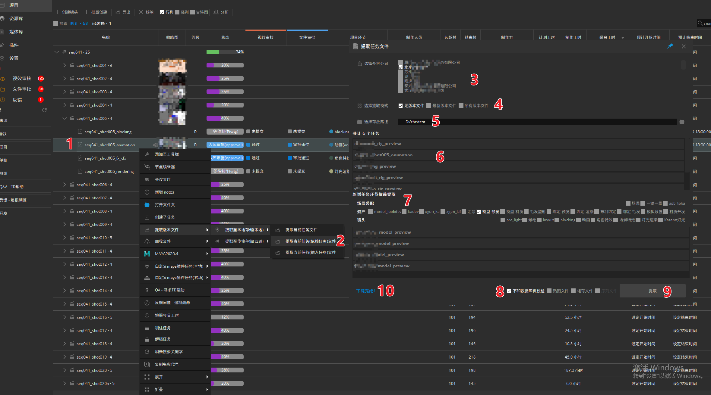

## 外包任务分配
1. 找到要指定的实体 (资产/场景装配/镜头/..)，图示以一个镜头实体为例
2. 切换到`竖列`模式方便对`多个实体`的`相同环节`同时指定，`行列`方便对`同一实体`内的`多个环节`同时指定
3. 选中所有需要修改的任务条，在`制作方`一栏点击铅笔图标进行修改，图示以该镜头的layout环节任务为例
4. 弹出的界面内是数据库目前已记录的所有供应商 ，选择对应的供应商并点击确认即可指认任务，如果列表内没有所需供应商，需要联系官方技术人员配置添加 
5. 在修改完成后可以看到制作方已经更新为新的公司  
  
  

## 任务文件提取给外包
- **本地提取** (将文件提取到本机的本地路径)
1. 找到要提取的任务，图示以一个镜头的动画环节任务为例，提取关联的资产动画文件等到本地路径
2. 在任务上右键选择`提取版本文件` - `提取至本地存储（本地）` - `提取任务文件`/`提取当前任务（依赖任务）文件`/`提取当前任务（输入任务）文件`，一般使用`提取当前任务（依赖任务）文件`即可
    + `提取任务文件`：提取当前环节单环节的任务文件，不提取上游关联文件
    + `提取当前任务（依赖任务）文件`：提取当前环节以及上游依赖文件，只提取最依赖的文件，不多余提取
    + `提取当前任务（输入任务）文件`：提取当前环节以及所有上游文件，输入任务全部提取
3. 选择接收文件的外包公司，可以多选同时给到多家外包商，软件内会同步信息
4. 选择提取模式，一般勾选无版本文件将会给到不带版本号的最新文件，如果有需要可以勾选最新版本文件或所有版本文件
5. 选择文件提取后的存放路径，可以点击后面的文件夹选择
6. 中间列表内是该环节任务自动识别到的所有依赖任务文件
7. 如果有需要增加其他环节的关联任务文件，可以自行在下方勾选对应环节，识别到的任务文件将会展示在界面下方的列表内
8. 可以自行选择是否提取`贴图文件`和`缓存文件`，以及是否与数据库做对比
9.  确认所有提取文件之后点击`提取`将会开始提取流程
10. 在进度条走完之后，在界面下方会显示`下载完成！`，这表示已经提取完成，外包端刷新文件管理将可以看到更新的文件信息
   
  
- **云端提取** (将文件提取到云端)
1. 找到要提取的任务，图示以一个镜头的动画环节任务为例，提取关联的资产动画文件等到云端数据，可以同步到外包端
2. 在任务上右键选择`提取版本文件` - `提取至传输存储（云端）` - `提取任务文件`
3. 选择接收文件的外包公司，可以多选同时给到多家外包商
4. 中间列表内是该环节任务自动识别到的所有依赖任务文件
5. 如果有需要增加其他环节的关联任务文件，可以自行在下方勾选对应环节，识别到的任务文件将会展示在界面下方的列表内
6. 确认所有提取文件之后点击`提取`将会开始提取流程
7. 在进度条走完之后，在界面下方会显示`提交完成！`，这表示已经提取完成，外包端刷新文件管理将可以看到更新的文件信息

  

## 文件更新

## 回收外包文件