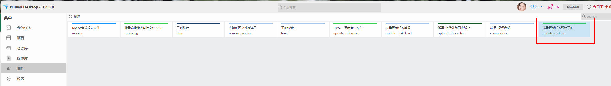

批量更新工时的预计工时

### 启动插件
- 菜单启动 
    `zFused Desktop/zFused Link` > `插件` > `批量更新任务预计工时`

### UI

1. 选择当前项目
2. 选择需要更新的类型，资产为Asset,镜头类为Shot
3. 导入待更新的表格
4. 选择需要更新的步骤
5. 预览Preview 更新的数据
6. 点击update按钮，将文本数据更新到服务器

### 模板
可以通过模板下载，下载当前更新的数据的数据模板
+ 镜头类：

1. episode 当前镜头的集(如果没有可不填)

2. sequence 当前镜头的场次(如果没有可不填)

3. shot 当前镜头镜头号(必填)
4. 待修改的数据

+ 资产类：

1. 当前资产的代号(必填)
2. 待修改的数据

