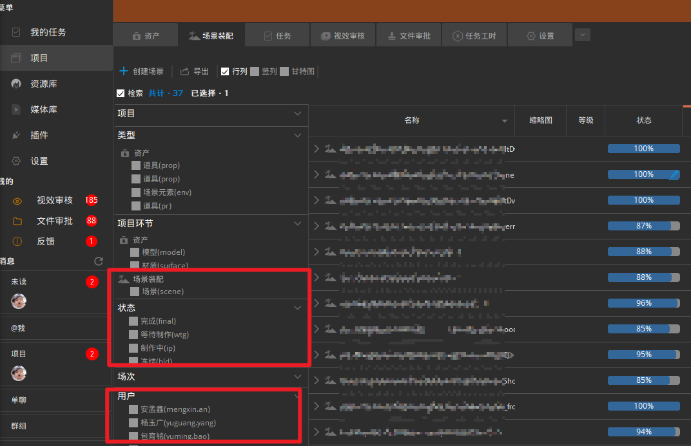
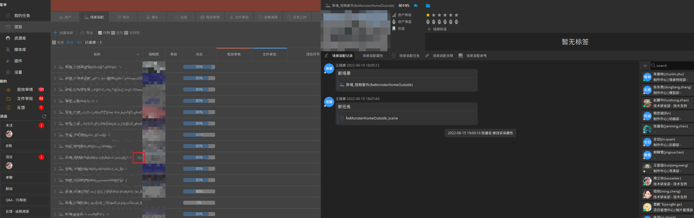

## 新建场景装配
点击`项目` - `场景装配` - `创建场景`，在界面中填入名称与代号，状态默认为激活，如果有需要输入相关描述，点击确认创建
> 如果状态一栏为空白则无法成功创建，需要先检查[状态](#场景装配状态)是否有配置

## 检索场景装配
+ 勾选`项目` - `场景装配` - `检索`，会弹出筛选面板，在这里可以根据不同条件筛选资产和任务
+ 在右上角面板处可以输入关键字筛选符合的场景装配及任务，支持中英文搜索

## 场景装配状态
+ 基本场景状态分为`激活`、`制作中`、`完成`、`冻结` 
+ 新的场景状态配置在`项目` - `设置` - `项目实体` - `场景装配` - `状态` 中点击`添加状态`， 在界面列表中选择添加
  
+ 如果需要添加自定义状态而当前列表中没有，请联系我方技术人员配置添加

## 场景装配信息
1. 在`项目` - `场景装配`内，找到目标场景，点击名称后方的小眼睛可以展开场景信息面板 
2. `场景装配记录`内是该场景装配的会议大厅，这里显示的是会议内成员针对场景装配的讨论历史记录以及场景装配相关任务修改时自动触发生成的一些记录信息，点击下方消息框可以发送消息，右侧为程序自动添加的会议成员，如果需要添加新成员可以点击上方 `十` 拉人进会议
3. `场景装配属性`内是场景装配创建的信息，与场景装配创建时的信息相匹配
4. `场景装配任务`内是该场景装配相关的所有任务，在这里也可以创建新的任务
5. `场景装配关联`内是与该场景装配有关的其他实体信息，上下游环节关联信息，场景装配一般是作为上游流入后面的镜头内，在这里可以看到下游使用到该场景装配的镜头信息，和上游使用到的场景元素信息
6. `场景装配参考`内为场景装配的相关参考文件信息
