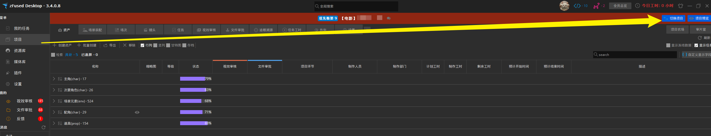
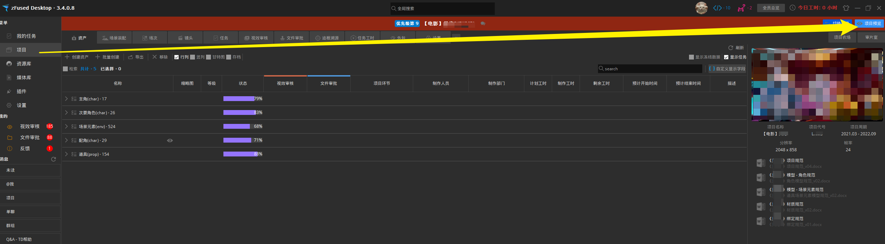
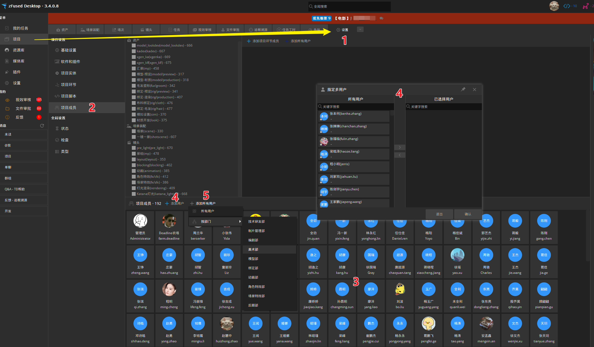
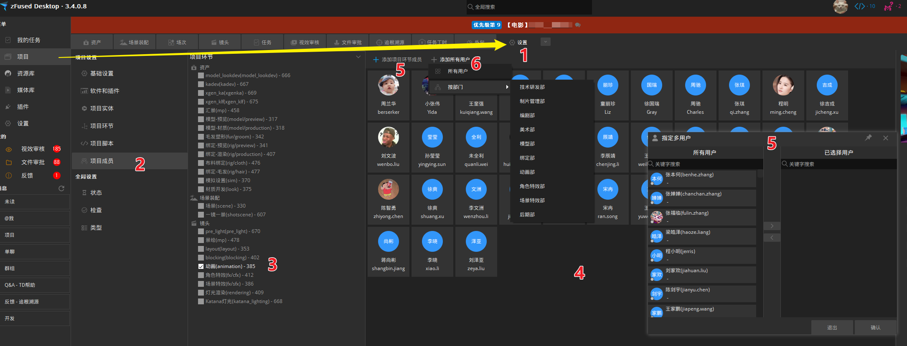
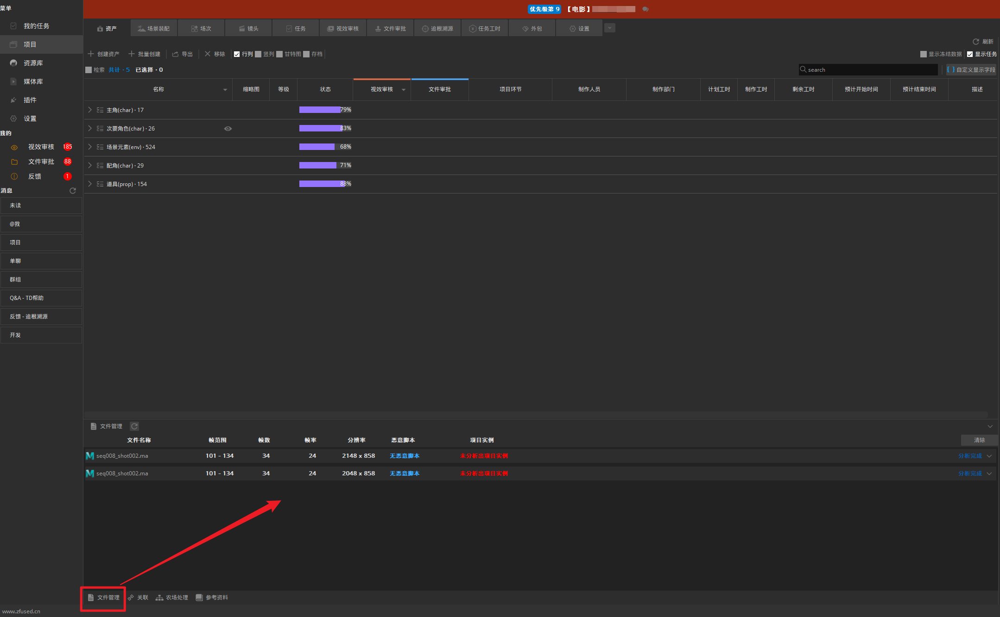

## 新建项目
项目创建以及基础配置需要联系本公司技术人员部署

## 切换项目
点击`项目` - `资产` - `切换项目`，在弹出的界面中选择要切换的项目，双击即可切换至目标项目

## 项目预览
点击`项目` - `资产` - `项目预览`，可以显示项目相关信息及规范文档，点击图片可切换项目缩略图

## 添加项目成员
只有处于项目内的成员才可以看到该项目详细信息，分配任务前需要先将成员添加到项目中，制作人员可以直接在环节内添加
1. 点击`项目` - `设置`
2. 选择`项目成员`
3. 下方面板内展示的是目前所有该项目内的成员
4. 手动添加成员可以点击`添加用户`，在弹出的面板中搜索用户，支持中英文关键字搜索和多选，在目标用户上双击或点击面板中央的右键头 `>` ，将用户添加到已选择用户中，点击确认即可添加
5. 批量添加成员可以点击`添加所有用户`，可以一键添加所有的用户，或按照部门批量添加，部门成员设置详见[部门设置](/desktop/member/department.md#部门人员)

## 添加环节成员
处于环节内的成员才可以领取该环节任务，成员在添加到环节时会自动添加到总项目成员内，不需要再次添加
1. 点击`项目` - `设置`
2. 选择`项目成员`
3. 筛选环节
4. 面板内展示的是目前所有该环节内的成员
5. 手动添加成员可以点击`添加用户`，在弹出的面板中搜索用户，支持中英文关键字搜索和多选，在目标用户上双击或点击面板中央的右键头 `>` ，将用户添加到已选择用户中，点击确认即可添加
6.  批量添加成员可以点击`添加所有用户`，可以一键添加所有的用户，或按照部门批量添加，部门成员设置详见[部门设置](/desktop/member/department.md#部门人员)

## 文件管理
检查文件`帧数`、`帧率`、`分辨率`、`病毒`、`项目实例`等信息

## 项目变量
用于和DCC软件交互设计的自定义变量，为开发人员使用
