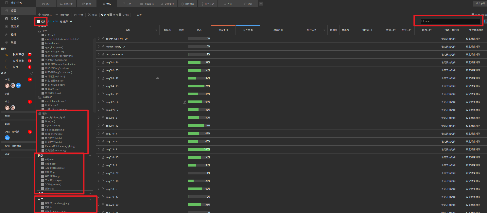
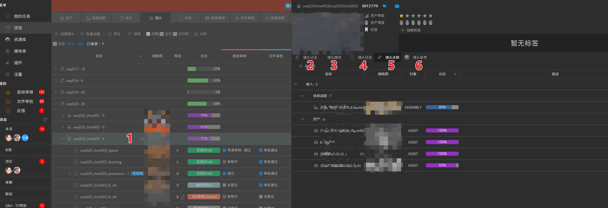

## 新建集
一般情况下剧集项目需要创建集数，电影项目不区分集数
点击`项目` - `集` - `创建集`，在界面中填入集名称与代号，状态默认为激活，点击确认创建
  > 如果状态一栏为空白则无法成功创建，需要先检查集的[状态](#镜头状态)是否有配置，集的状态在`项目` - `设置` - `项目实体` - `集` - `状态`

  

## 场次创建
- 单独创建
点击`项目` - `场次` - `创建场次`，在界面中选择集数，如果没有集数就默认空白即可，填入场次名称与代号，状态默认为激活，点击确认创建
  > 如果状态一栏为空白则无法成功创建，需要先检查场次的[状态](#镜头状态)是否有配置，场次的状态在`项目` - `设置` - `项目实体` - `场次` - `状态`
  
  
- 批量创建

## 镜头创建
- 单独创建
点击`项目` - `镜头` - `创建镜头`，在界面中选择集数和场次，如果没有集数就默认空白即可，填入镜头名称与代号，状态默认为激活，点击确认创建
  > 如果状态一栏为空白则无法成功创建，需要先检查镜头的[状态](#镜头状态)是否有配置
  
  
- 批量创建

## 镜头状态
+ 基本镜头状态分为`激活`、`制作中`、`完成`、`冻结` 
+ 新的镜头状态配置在`项目` - `设置` - `项目实体` - `镜头` - `状态` 中点击`添加状态`， 在界面列表中选择添加
  
+ 如果需要添加自定义镜头状态而当前列表中没有，请联系我方技术人员配置添加

## 检索镜头
+ 勾选`项目` - `镜头` - `检索`，会弹出筛选面板，在这里可以根据不同条件筛选镜头和任务
+ 在右上角面板处可以输入关键字筛选符合的镜头及任务，支持中英文搜索

## 镜头信息
1. 在`项目` - `镜头`内，找到目标镜头，点击名称后方的小眼睛可以展开镜头信息面板 
2. `任务记录`内是该镜头的会议大厅，这里显示的是会议内成员针对该镜头的讨论历史记录以及镜头相关任务修改时自动触发生成的一些记录信息，点击下方消息框可以发送消息，右侧为程序自动添加的会议成员，如果需要添加新成员可以点击上方 `十` 拉人进会议
3. `镜头属性`内是镜头创建的信息，与镜头创建时的信息相匹配
4. `镜头任务`内是该镜头相关的所有任务，在这里也可以创建新的任务
5. `镜头关联`内是与该镜头有关的其他实体信息，上下游环节关联信息，镜头的关联实体一般有输入的场景装配和资产
6. `镜头参考`内为镜头的相关参考文件信息
