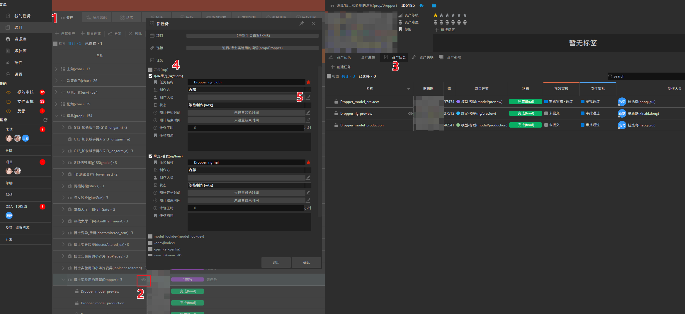
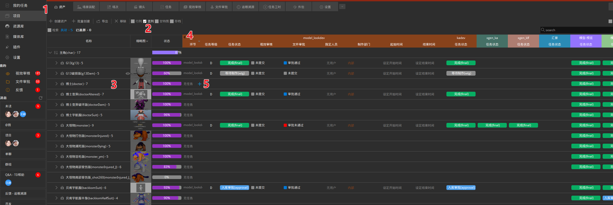

项目任务管理
## 任务创建
+ **常规创建**
1. 以资产任务为例，点击`项目` - `资产`（场景或镜头任务点击`项目` - `场景装配`/`镜头`）
2. 找到对应资产在对应资产名称后方点击小眼睛打开资产详情页面
3. 选择`资产任务`栏
4. 在弹出的界面中勾选要创建任务的环节，支持多选同时创建，已被创建过的任务呈现暗灰色不可以重复创建
1. 勾选后会弹出任务设置界面，再这里可以直接设置任务信息，比如制作人员制作状态等

 
+ **快捷创建**
1. 点击`项目` - `资产`（场景或镜头任务点击`项目` - `场景装配`/`镜头`）
2. 切换显示模式为竖列，可以同时列出多个资产的环节任务情况
3. 找到要创建任务的资产
4. 找到要创建任务的环节，点击左侧箭头展开环节信息
5. 在对应资产的对应环节处，点击加号`十`，即可创建出该资产的对应任务，支持多选资产同时创建

## 子任务
子任务主要用于多人协作的任务区分与填写工时，不支持发布文件（只可以在主任务上发布）

在任务上右键可以创建该任务的子任务，子任务放在主任务的下一层级

## 任务状态
+ 基本任务状态分为`等待制作`、`制作中`、`入库审批`、`完成`、`冻结` 
+ 新的任务状态配置在`项目` - `设置` - `项目实体` - `任务` - `状态` 中点击`添加状态`， 在界面列表中选择添加
  
+ 如果需要添加自定义任务状态而当前列表中没有，请联系我方技术人员配置添加

## 任务检索
+ 勾选`项目` - `任务` - `无分组`，在这里可以选择任务分组条件，将按照所需的规则归纳任务

+ 勾选`项目` - `任务` - `检索`，会弹出筛选面板，在这里可以进一步根据不同条件筛选任务
+ 在右上角面板处可以输入关键字筛选符合的任务，支持中英文搜索

## 任务信息
1. 在对应实体内，找到目标任务，点击名称后方的小眼睛可以展开任务信息面板
2. `任务记录`内是该镜头的会议大厅，这里显示的是会议内成员针对该任务的讨论历史记录以及任务状态有修改时自动触发生成的一些记录信息，点击下方消息框可以发送消息，右侧为程序自动添加的会议成员，如果需要添加新成员可以点击上方 `十` 拉人进会议
3. `重点批注`内是该任务的批注历史，记录了所有的note信息，在这里也可以新建note批注
4. `视效审核`内是该任务所有上传过的图片或视频审核记录，记录了所有审核历史版本与相关审核状态、描述等
5. `文件审批`内是该任务所有上传过的文件审批记录，记录了所有审批历史版本与相关审批状态、描述等
6. `关联任务`内是与该任务有关的其他实体任务信息，上下游环节的关联任务信息
7. `文件记录`内是该任务上传发布过的所有文件历史信息，包括maya动画文件、相机文件和缓存abc、gpu等类型
8. `关联视效`内为该任务前后环节上传过的图片或视频审核，方便直观查看上下游的成果文件

## 锁定与解锁

## 文件领取

## 文件提取打包

## 自定义插件

## 节点编辑器