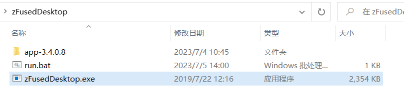

`zFused Desktop` 制片管理端安装与更新

## 安装
甲方提供软件安装包，包含zFusedDesktop应用程序和依赖文件，将整个文件夹拷贝到任意本地路径

## 启动登录
1. 双击`zFusedDesktop.exe`应用程序，启动客户端
2. 选择内部服务器，输入账户密码，如果没有账户需要先[创建账户](/desktop/member/user.md)
3. 可以更改主题颜色为黑色或白色

## 更新
如果云端有软件版本更新，消息会同步到客户端，打开应用程序之后顶端会显示有最新版，需要及时更新，点击`下载更新`会开始分析版本文件并更新，完成后点击`重新启动`，重新登录即可完成更新

