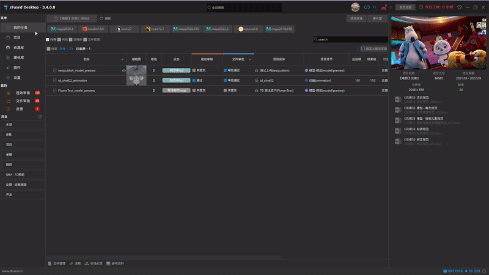
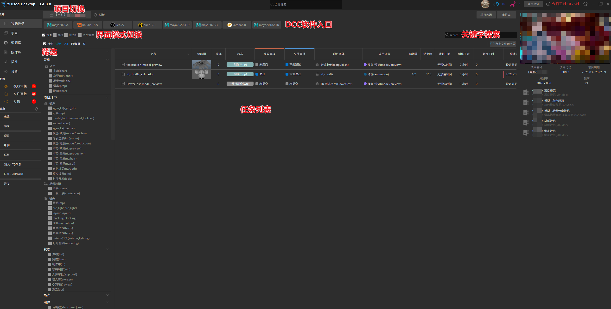
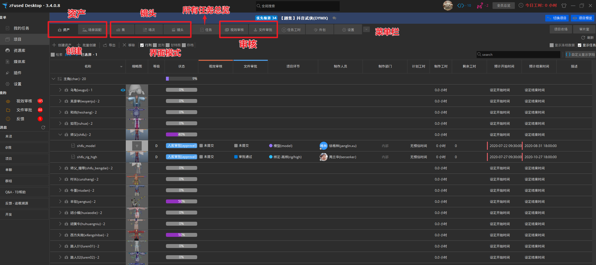

主界面总览

## 总菜单
+ [我的任务](#我的任务)：当前登陆账户的所有任务，项目DCC启动器
+ [项目](#项目)：项目详细信息，资产镜头等实体和任务创建
+ 资源库：模型、动画、特效等资源库
+ 媒体库：视频资源库
+ 插件：集成插件库，包括文件视频图像处理等工具，由技术人员持续更新
+ 设置：软件架构设置，账户部门软件等  

  

## 我的任务

  

## 项目
  
