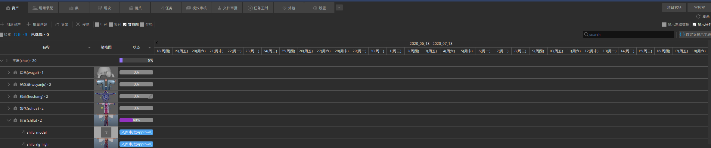
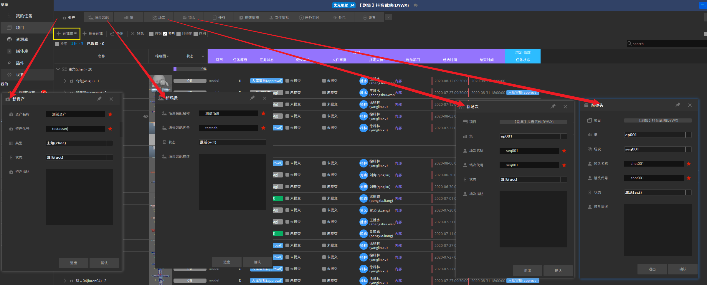
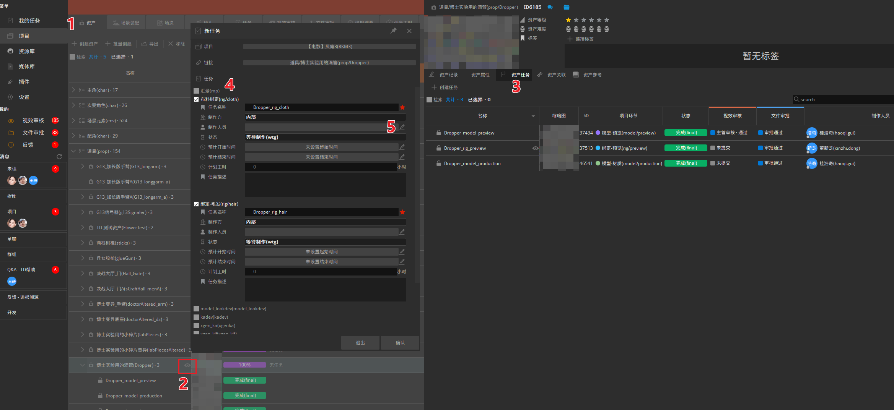
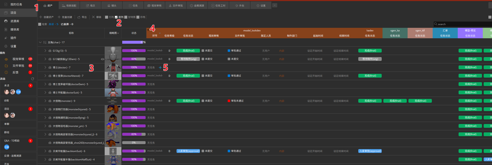

## 界面切换
在涉及到任务环节的实体模块（资产/场景/镜头）可以切换显示模式，以满足不同需求下的视图显示
+ **行列**：以行列模式显示实体下的所有环节任务，方便直观的看到单实体的环节和任务情况
    点击实体前的箭头可以展开查看所有相关环节任务，在这里可以快速查看或修改任务信息  

+ **竖列**：以竖列模式显示实体下的所有环节任务，方便同时一览所有实体的环节和任务情况
    点击环节名称左端的箭头可以展开查看单环节任务

+ **甘特图**：显示任务甘特图

## 实体新建（资产/场景/镜头）
在对应模块下点击左上角的`创建资产`/`创建场景`/`创建镜头`，状态默认选择为激活，
+ 在创建镜头前需要提前创建好场次，可以没有集信息，但必须要有场次信息
+ 如果状态一栏为空白则无法成功创建，需要联系我方技术人员配置相关状态

## 环节新建
新建环节涉及到流程传递，需要联系zFused官方技术人员创建部署

## 任务创建
涉及到任务环节的实体模块（资产/场景/镜头）可以创建任务，三者创建方式相同，在对应模块下操作即可，以资产为例：
+ **常规创建**
  1. 点击对应模块，以资产任务为例即点击资产
  2. 在实体上点击小眼睛打开实体详情
  3. 选择实体任务栏
  4. 勾选要创建任务的环节，支持多选
  5. 勾选后会弹出任务设置界面，再这里可以设置任务信息，比如制作人员

    
+ **快捷创建**
  1. 点击对应模块，以资产任务为例即点击资产
  2. 切换显示模式为竖列，可以同时列出多个资产的环节任务情况
  3. 找到要创建任务的资产
  4. 找到要创建任务的环节，点击左侧箭头展开环节信息
  5. 在对应资产的对应环节处，点击加号`十`，即可创建出该资产的对应任务，支持多选资产同时创建
    
    

## 任务分配人员
找到任务详情部分的`指定人员`列，点击人物图标，即可在弹出的界面中选择制作人员将任务分配给他，下图分别为行列与竖列显示模式下，人员指定的位置
+ 如果指定用户界面中找不到目标人员，请先确认该用户是否被添加到该项目的环节成员中

## 实体状态
+ 资产、场景、镜头类型实体的状态显示为百分数，对应为整个实体的制作上传进度，在这里可以点击将对应实体设置冻结状态  

  
+ 任务类型实体的状态显示为具体的信息  

## 外包分配