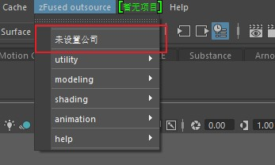

`zFused Outsource` 外包插件安装与更新

## 安装需求
- 需要链接互联网
- 如果开翻墙软件可能会导致插件运行效率降低
- 如果限制上网行为，可以单独开通IP地址 47.103.77.93

## 插件信息
+ 插件名称：zFused_outsource
+ 插件完整地址 ：P:\zfused\pipeline  (本路径需开通读取和修改权限)
+ 插件完整路径：P:\zfused\pipeline\zfused_outsource


## 插件更新
__1. 从我们的github地址下载最新的pipeline代码 [`仓库地址`](https://github.com/zhoulh0322/zfused_outsource)__


__2. 插件内部的更新按钮__


__3. 插件内部的更新命令__
```python
from zwidgets.updatewidget import updatewidget
ui = updatewidget.UpdateWidget()
ui.show()
```

## DCC插件安装
Maya 插件安装
+ 将useSetup.py 文件 拷贝至 我的文档\maya\版本\scripts\目录下
+ P:\zfused\pipeline\zfused_outsource\scripts\maya\ userSetup.py

Houdini 插件安装
+ 将123.py 文件拷贝至 我的文档 \houdini版本 \scripts\目录下
+ P:\zfused\pipeline\zfused_outsource\scripts\houdini\ 123.py

Katana 插件安装
+ 将 init.py 文件拷贝至 C:\Users\用户名\.katana\Startup\ 目录下
+ P:\zfused\pipeline\zfused_outsource\scripts\katana\ init.py

## 公司登陆
插件需要设置公司名称，点击设置切换公司



插件初次启动，会提示输入公司名称，可填写公司简称，系统自动匹配


## 项目选择
插件设置公司后可切换至具体项目


