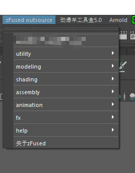

# 解算文件发布

## 启动任务栏窗口
+ 点击maya状态栏的zfused_outsource

+ 
+ 点击utility

+ 选择任务管理(Task Mangage)

## 任务管理界面
+ 

### 选择镜头-角色特效(fx/cfx)

+ 筛选出了所有的解算任务，根据场次、镜头号双击进入任务发布窗口

## 任务发布窗口

### 下载文件
+ 可以领取之前发布的文件
+ 首次领取可以领取上游环节发布的文件
### 上传文件
+ 发布文件内容
    #### 发布文件
    + 
    + 文件发布分为 新版本上传和当前版本更新
    + 新版本上传 生成最新版的版本号
    + 当前版本更新，不生成新的版本号，并覆盖最新版的文件和缓存
    + 屏幕截图 截取当前文件的屏幕以作为缩略图
    + 上传描述信息 简单介绍当前任务文件的发布内容
    + 点击发布

### 制作过程文件
+ 打开制作过程中保存的文件
###  更新文件
+ 更新当前文件中的资产

# 解算文件发布注意事项
+ 发布文件后，数据信息会同步到数据库上，需要提取给到尤尼提并同步数据库(提取方法另行介绍)
