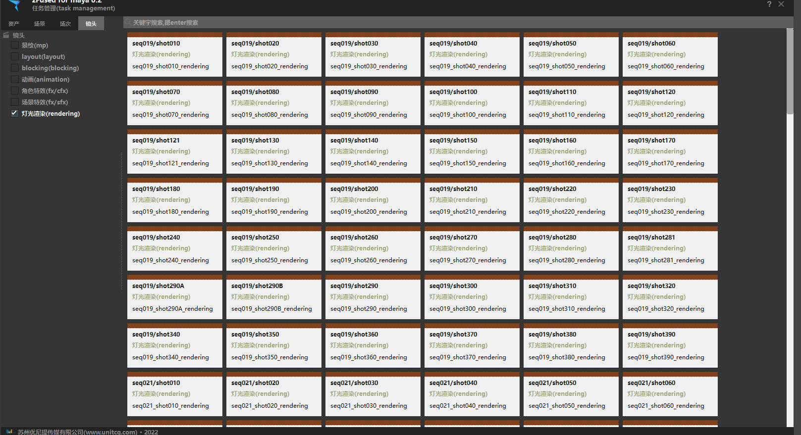
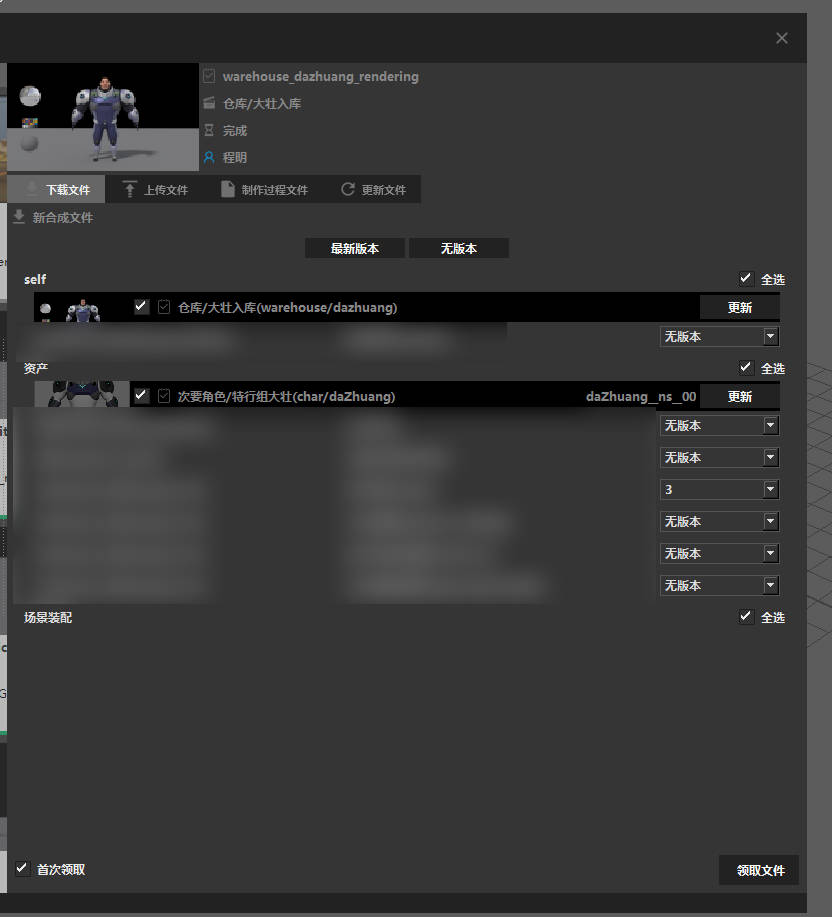

# 灯光文件领取

## 启动任务栏窗口
+ 点击maya状态栏的zfused_outsource

+ 
+ 点击utility

+ 选择任务管理(Task Mangage)

## 任务管理界面
+ 

### 选择镜头-灯光渲染(rendering)

+ 筛选出了所有的解算任务，根据场次、镜头号双击进入任务发布窗口
  

## 任务窗口

+ 可以领取之前发布的文件
+ 首次领取可以领取上游环节发布的文件

    ### 首次领取文件
    + 可以领取动画(解算)发布的文件或者动画(解算)发布的缓存并处理合成
    
    + 可以选择最新版本或无版本
    + 最新版为所有资产或者缓存为带版本号的资产缓存
    + 无版本为所有资产或缓存为不带版本号的缓存
    ### 领取发布过的文件
    + 可以领取之前发布过的文件

# 灯光任务文件领取注意
