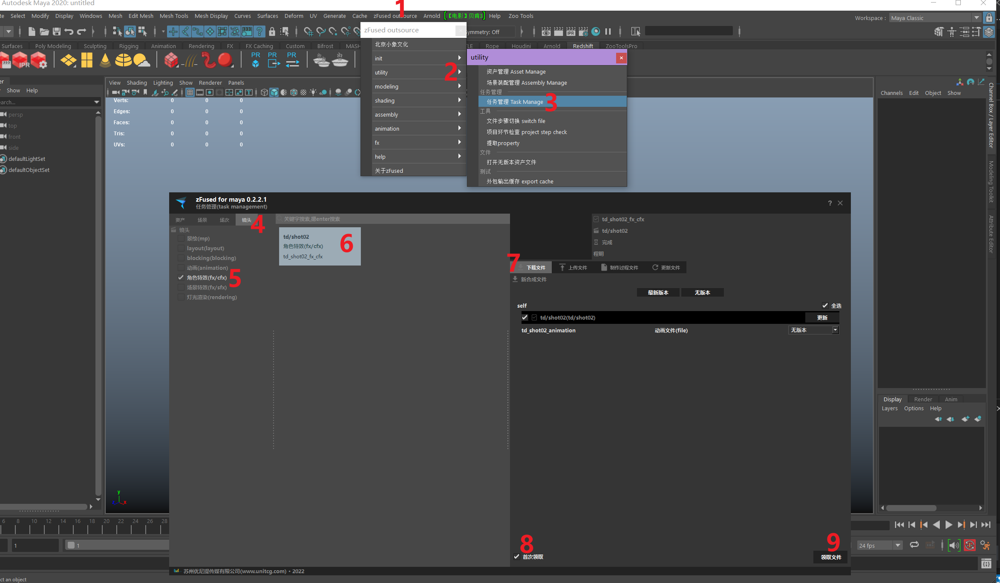
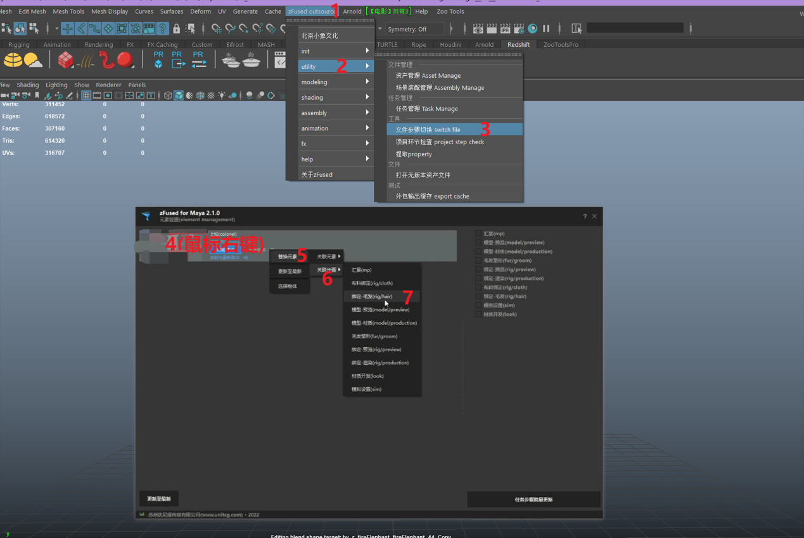
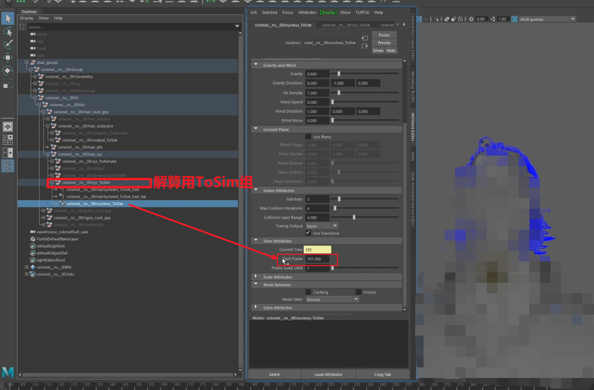

---

## 解算  
> 注意：制作过程中时常保存文件，避免maya崩溃重做

### **1. 领取动画文件**  
    

- 启动任务管理  
`zfused_outsource` > `utility` > `任务管理（Task Manage）`
- 在`角色特效`环节找到当前镜头的任务
- 点击`首次领取`获取动画文件 （不点击首次领取将领到当前角色特效环节的制作过程文件）

### **2. 替换毛发绑定文件**  
有毛发解算的角色才需要替换绑定，如果没有毛发解算直接跳过这一步和下一步

- 启动步骤切换插件（）  
`zfused_outsource` > `utility` > `文件步骤切换（switch file）`
- 将当前`绑定-预览`切换为`绑定-毛发`
- 将`ToSim`组中的解算器起始帧改为101帧，即可开始调整形态  
  

### **3.制作并输出毛发缓存**  

**4. 出解算缓存**
 
**5. 赋予缓存**
 
**6. 发布文件**
   
---

## 后期