---

## 解算  
> 注意：制作过程中时常保存文件，避免maya崩溃重做

### **1. 领取动画文件**  
    

- 启动任务管理  
`zfused_outsource` > `utility` > `任务管理（Task Manage）`
- 在`角色特效`环节找到当前镜头的任务
- 点击`首次领取`获取动画文件 （不点击首次领取将领到当前角色特效环节的制作过程文件）

### **2. 替换毛发绑定文件**  
有毛发解算的角色才需要替换绑定，如果没有毛发解算直接跳过这一步和下一步

- 启动步骤切换插件（）  
`zfused_outsource` > `utility` > `文件步骤切换（switch file）`
- 将当前`绑定-预览`切换为`绑定-毛发`
- 将`ToSim`组中的解算器起始帧改为T-pose 所在帧，即可开始调整形态  
  

### **3.制作并输出毛发缓存**  
- 选择 `fx`->`fur` ->`hair_root_grp`-> `hair_outputcv` ->`output_ToSim`组，输出该组曲线abc缓存，输出路径放在自己能找到得到的地方就可以
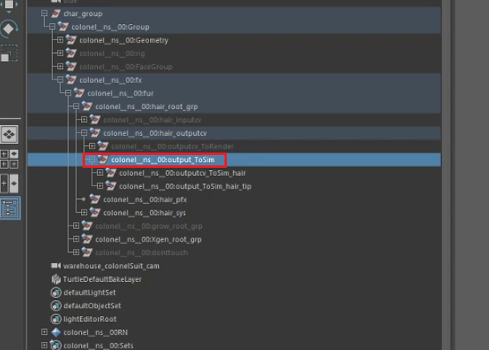

### **4. 替换布料解算绑定**
- 启动步骤切换插件（）  
  `zfused_outsource` > `utility` > `文件步骤切换（switch file）`
- 将当前`绑定-预览`切换为`布料绑定`
- 参考替换毛发绑定
- 将`fx` ->`cloth_cfx`组中的解算器起始帧改为T-pose 所在帧，即可开始调整形态

### **5.制作并输出布料缓存**
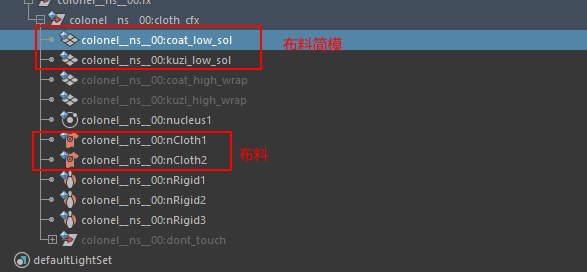
- 导出布料缓存
  确定简模动态后，将`fx` ->`cloth_fx` 组中隐藏的高模导出abc缓存，输出路径自定义即可  
  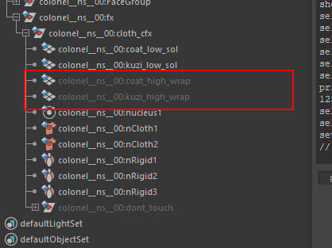

- 在导出abc时，要注意一下选项务必勾选和选择   
  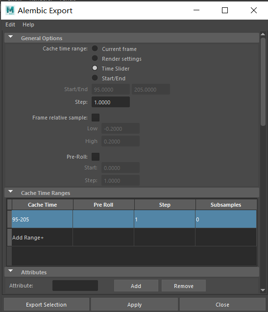
  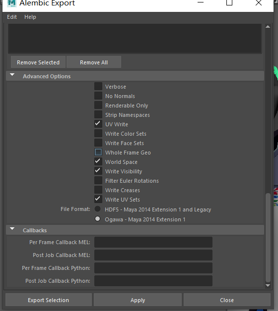

### PS
> 1. 为方便后期渲染运动模糊，务必前后多出5帧缓存
> 2. 务必选中输出uv
> 3. 务必选中world space
> 4. 务必选中输出显示属性
> 5. 务必选中输出uv sets

### **6. 赋予缓存** ###
- 根据上述领取动画文件和替换rig的方法，领取干净的动画文件，并替换为毛发rig或布料rig
- 导入上述规则出的毛发abc 和布料abc  
  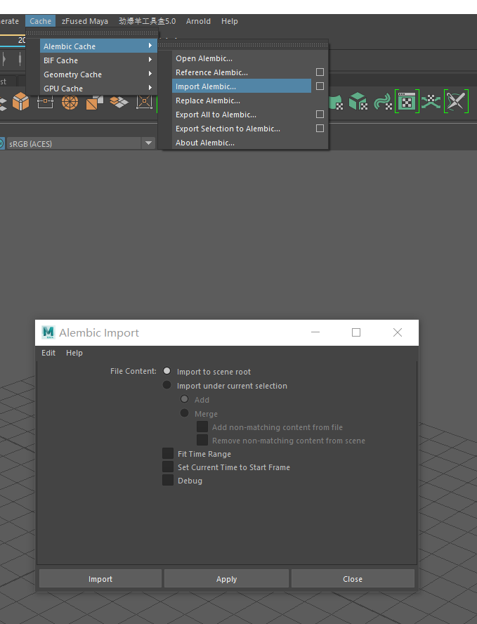
  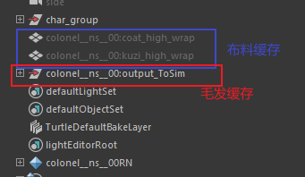

- 将上述缓存按照下列规范进行打组并隐藏  
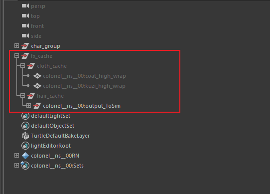

- 将毛发缓存`output_ToSim` 和 rig_hair组里面的`output_ToSim`做BS，注意先选缓存再选rig_hair的毛发曲线
- 做BS 时应当选择world 模式  
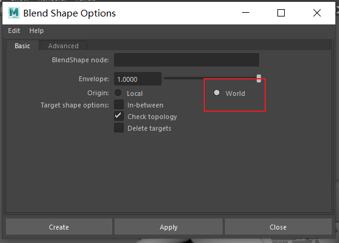

- 随机选中一根曲线，将BS节点 的属性改为1  
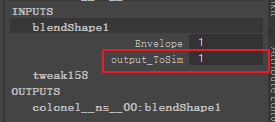
- 将布料缓存和`char_group`->`group`->`Geometry`->具体部位的高模做BS  
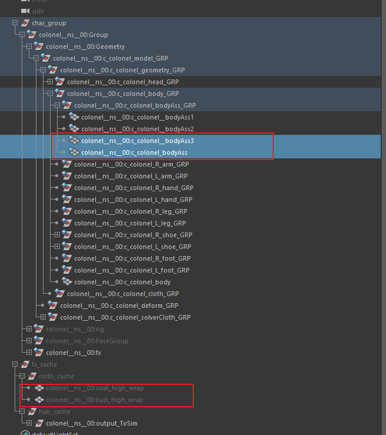

- 按照毛发的方法，将BS 节点属性改为1即可

### PS
> 1. 正常情况，如果资产有毛发文件，需要用毛发的rig_hair 来进行发布缓存
> 2. 如果毛发没有解算需求，也需要替换rig_hair 进行替换缓存

### **6. 发布文件** ###
- 替换好缓存后，将文件保存到本地路径  

- 启动任务管理  
  `zfused_outsource` > `utility` > `任务管理（Task Manage）`
- 在`角色特效`环节找到当前镜头的任务
- 点击`上传文件`发布解算文件
- 屏幕截图，写缩略图
- 简单描述发布的消息
- 输出采样默认为1
- 上传文件
---

## 后期