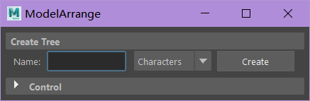
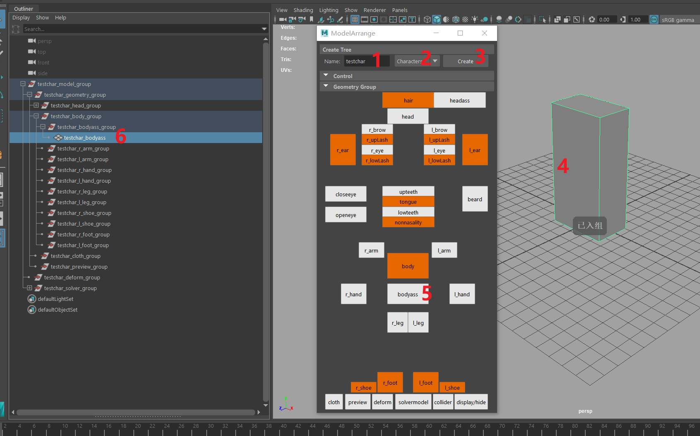
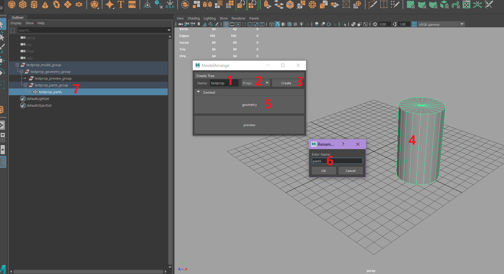
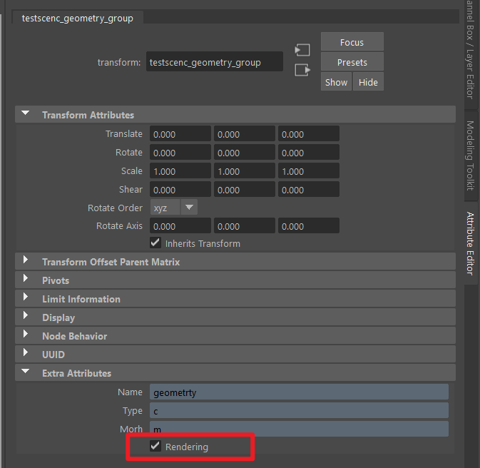

## 启动插件
- 菜单启动 
    `zfused_maya` > `modeling` > `Model Arrange`
- 代码启动
    ```python
    import zfused_maya.tool.modeling.modelArrange_new as modelArrange
    ui = modelArrange.Ui()
    ui.showUi()
    ```

## UI


## 角色组创建

1. 输入角色资产名称
2. 切换到角色模式（Characters）
3. 创建角色资产空组结构
4. 选择物体
5. 点击对应组
6. 物体已被放进对应组并自动重命名



## 道具组创建

1. 输入道具资产名称
2. 切换到道具模式（Props）
3. 创建道具资产空组结构
4. 选择物体
5. 点击geometry组
6. 输入零件名称
7. 物体已被放进geometry组下对应零件组内并自动重命名



## 场景组创建
与道具组创建方式相同，只是第二步改为场景模式（Scene）

## 注意
- 相同组内的模型命名相同，后缀会自动按照`_001`格式依次往上叠加
- 角色和道具的`_geometry_group` 组上带有rendering属性用于后续环节输出渲染模型，请勿勾掉该属性

