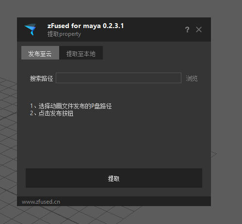

供应商发布的动画文件无法及时同步到服务器上，通过插件提取发布的信息给到优尼提，可以及时更新信息
# 启动插件

+ 菜单启动 `zufsed_outsource`>`utility`>`提取property`
+ 代码启动
    ```python 
  from zfused_maya.tool.technology.extract_info import extract_property
  ui = extract_property.ExtractProperty()
  ui.show()
  ```

# UI


1. 点击搜索路径的浏览按钮，输入动画文件发布的根目录,如：P:\XXX(项目名)\dcc\shot\场次名
2. 点击放置路径的浏览按钮，输入提取出的property的保存路径
3. 点击提取按钮

# 注意事项
+ 不要直接搜索盘符根目录，会速度很慢
+ 如有问题，及时和优尼提联系