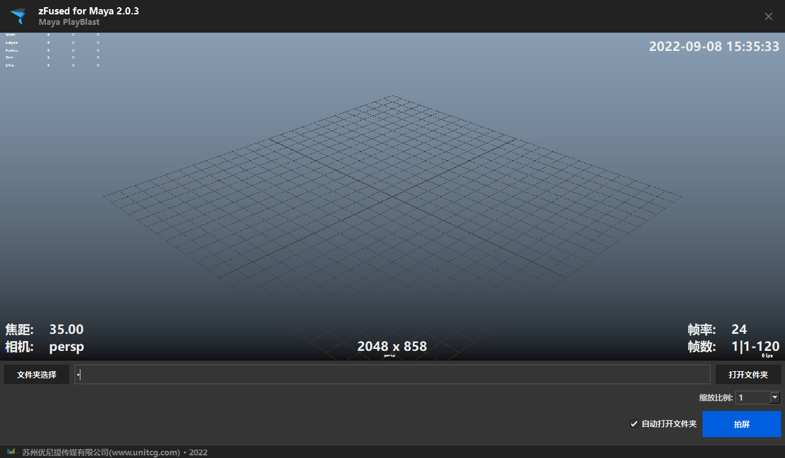

可自定义屏显拍屏系统，基于qt二次开发显示，完全可自定义

## 启动插件
- 菜单启动 
    `zfused_maya` > `utility` > `playblast`
- 代码启动
    ```python
    from zfused_maya.tool.technology.playblast import playblast_maya
    window = playblast_maya.Playblast()
    window.show()
    ```

## UI


## 拍屏设置
- 按照项目配置自动化设置尺寸，可支持 `1.0` `0.5` 倍缩放拍屏
- 可自定义设置存放目录，默认为当前文件地址

## 自定义配置
- 以`json`格式作为配置化文件，需提交到`zFused`项目变量里面
- 项目变量名为：`playblast_maya`

```python
{
    "hud": [
        {
            "color": "#EEEEEE",
            "code": "camera",
            "cmd": "import maya.cmds as cmds\nimport maya.OpenMaya as OpenMaya\nimport maya.OpenMayaUI as OpenMayaUI\nview = OpenMayaUI.M3dView.active3dView()\ncamDag = OpenMaya.MDagPath()\nview.getCamera(camDag)\ncameraname =camDag.fullPathName().split('|')[-2]\ntext =u\"  相机  {}\".format(cameraname)\n",
            "text-align": [-1,1,0]
        },
        {
            "color": "#EEEEEE",
            "code": "image_size",
            "cmd": "text = '分辨率  1920 x 1080'",
            "text-align": [0,1,0]
        },
        {
            "color": "#EEEEEE",
            "code": "camera_focal",
            "cmd": "import maya.OpenMaya as OpenMaya\nimport maya.OpenMayaUI as OpenMayaUI\nview = OpenMayaUI.M3dView.active3dView()\ncamDag = OpenMaya.MDagPath()\nview.getCamera(camDag)\ncurrent_cam = camDag.fullPathName().split('|')[-1]\nfocal_length = cmds.getAttr(\"{}.focalLength\".format(current_cam))\ntext =u\"焦距  {:.2f}\".format(focal_length)  \n",
            "text-align": [1,1,0]
        },
        {
            "color": "#EEEEEE",
            "code": "time",
            "cmd": "import time;text = \"  日期  {}\".format(time.strftime('%Y/%m/%d', time.localtime()))",
            "text-align": [-1,-1,0]
        },
        {
            "color": "#EEEEEE",
            "code": "username",
            "cmd": "import zfused_api\n_user_id = zfused_api.zFused.USER_ID\n_user_handle = zfused_api.user.User(_user_id)\ntext = \"制作者  {}\".format(_user_handle.profile[\"NameEn\"])",
            "text-align": [0,-1,0]
        },
        {
            "color": "#EEEEEE",
            "code": "frame",
            "cmd": "import maya.cmds as cmds\n_s_t = int(cmds.playbackOptions(q = True, min = True))\n_e_t = int(cmds.playbackOptions(q = True, max = True))\n# _format = '%0' + str(len(str(_e_t))) + 'd'\n# _c_t = _format%int(cmds.currentTime(q = True))\n_c_t = int(cmds.currentTime(q = True))\ntext = u'帧数  %s|%s-%s'%(_c_t,_s_t,_e_t)  ",
            "text-align": [1,-1,1]
        },
        {
            "color": "#EEEEEE",
            "code": "fps",
            "cmd": "import pymel.core as pm\n_frame = int(pm.mel.currentTimeUnitToFPS())\ntext = \"帧率  %s\"%str(_frame)\n_s_t = int(cmds.playbackOptions(q = True, min = True))\n_e_t = int(cmds.playbackOptions(q = True, max = True))\n_c_t = int(cmds.currentTime(q = True))\ncontent_text = '帧数  %s|%s-%s'%(_c_t,_s_t,_e_t)  \n",
            "text-align": [1,-1,0]
        }
    ],
    "font-size": 20,
    "bold": true,
    "color": "#FF0000",
    "spacing": 8,
    "text-height": 25,
    "image_size": [1920,1080
    ],
    "font-family": "Microsoft YaHei UI",
    "fps": 25,
    "margin": [8,8,8,8],
    "background-color": "#222222"
}
```