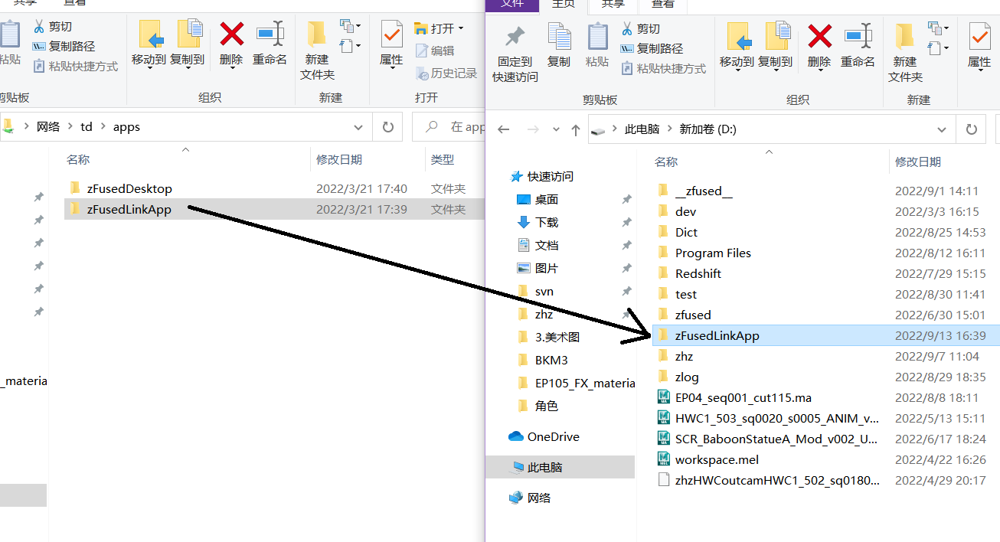
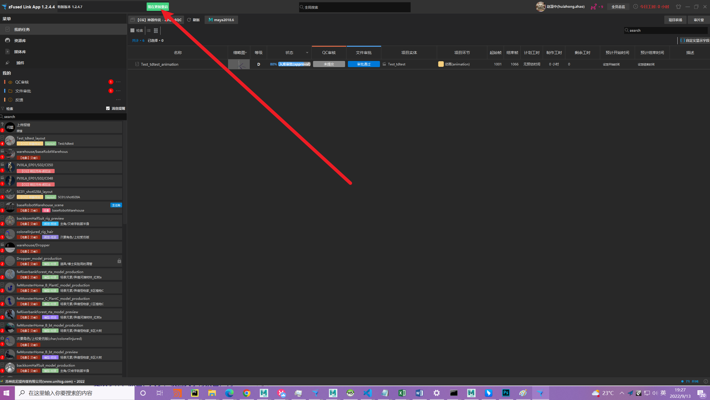

# 启动器 `zFused Link App` 安装与更新
---

## 安装
  
**1. 选取一位幸运TD帮你开通zf账户**  
  （等待开通过程中可以先进行下面步骤）

**2. 我的电脑进入网络位置 `\\td\apps`, 拷贝 `zFusedLinkApp` 文件夹到本地路径 (D盘或E盘)**

**3. 将`.exe`文件发送到桌面快捷方式**

**4. 在桌面找到zFusedLinkApp，双击启动，填入信息登录即可**

---

## 更新
zFused会不定时更新，当界面上方偏左出现绿色按钮 **现在更新重启** 时，点击按钮系统将会自动退出当前zFuse并完成更新回到登录界面

---

## 常见问题解决
> 软件点击没有反应，打不开
  
**解决办法一：**  
找到zFused安装路径（如果不知道安装路径在哪请看下图，安装包内部就长这样并且名为zFusedLinkApp，一般在D或盘之类的本地盘）删掉最近一个版本的文件夹（红框）  

**解决办法二：**  
重装zFused
