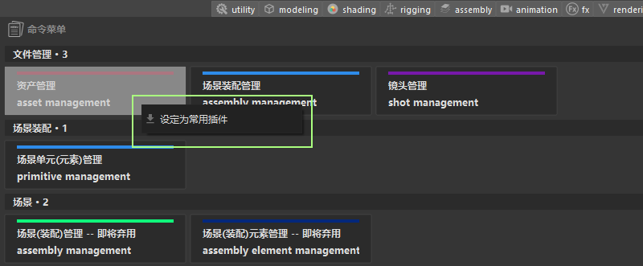
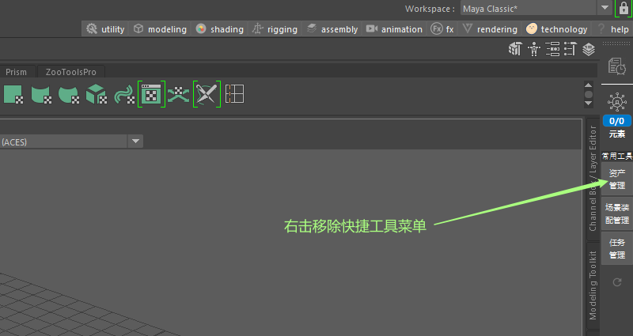

## 切换制作任务
快速预览自身当前`DCC`软件的任务，管理任务，任务文件的提交领取等等

+ 预览任务
打开快速任务预览面板，点击下拉菜单，查看当前`DCC`待制作任务

+ 设置当前制作任务
双击任务，切换当前制作任务

## 常用插件管理
`zfused maya`现已支持将现有的插件拖拽至`maya`主界面，便于快速启动插件。

+ 拖拽常用插件
打开插件UI面板，右击点击菜单 __设置为常用插件__

+ 移除常用插件
常用插件栏，右击即为 __移除常用插件__

