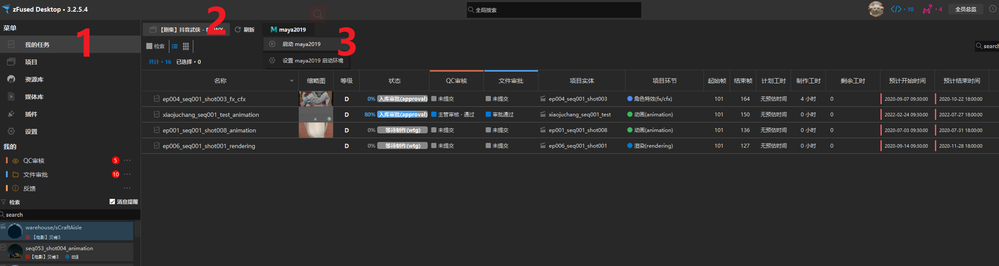
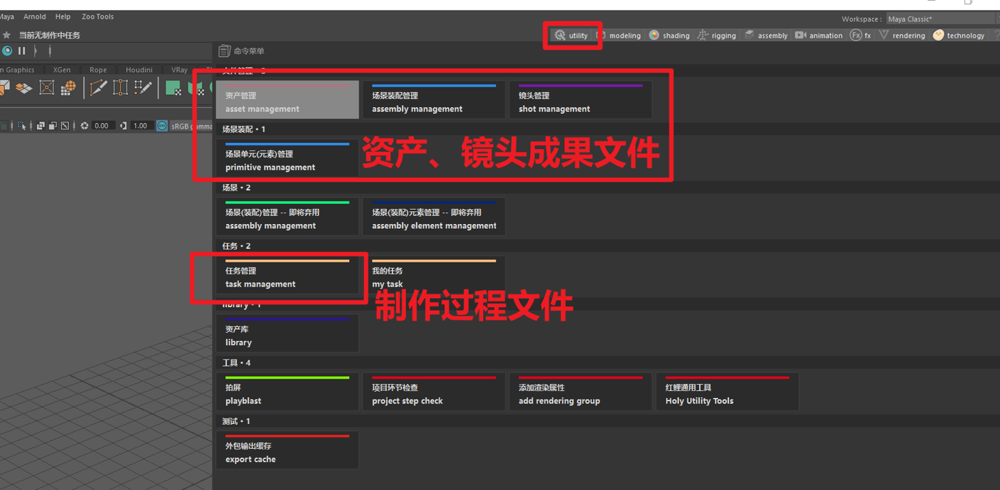
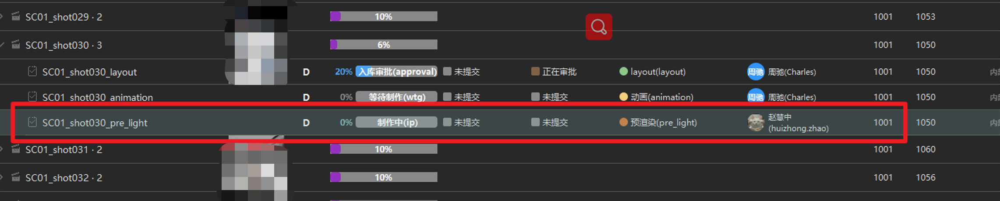
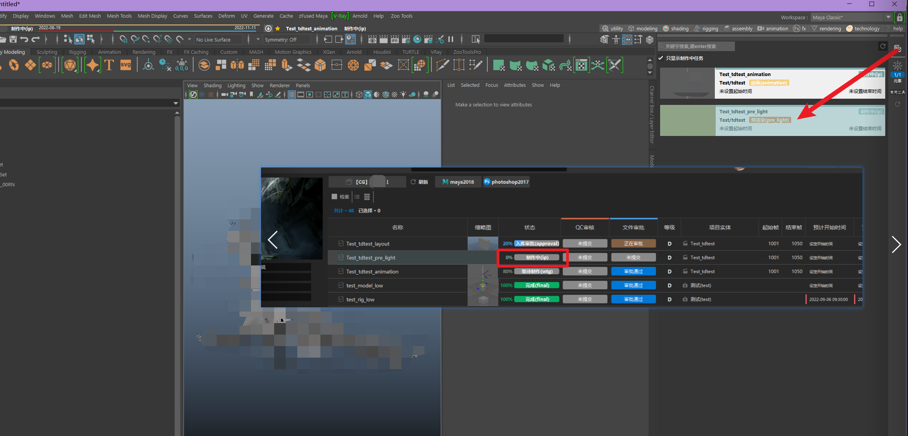
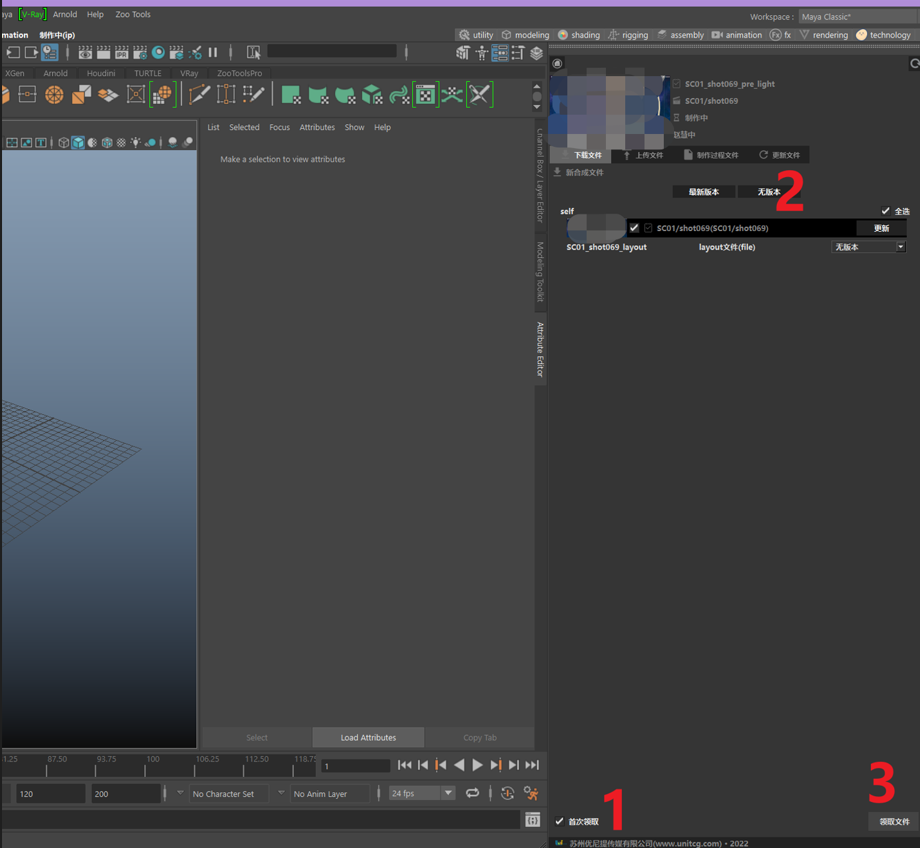
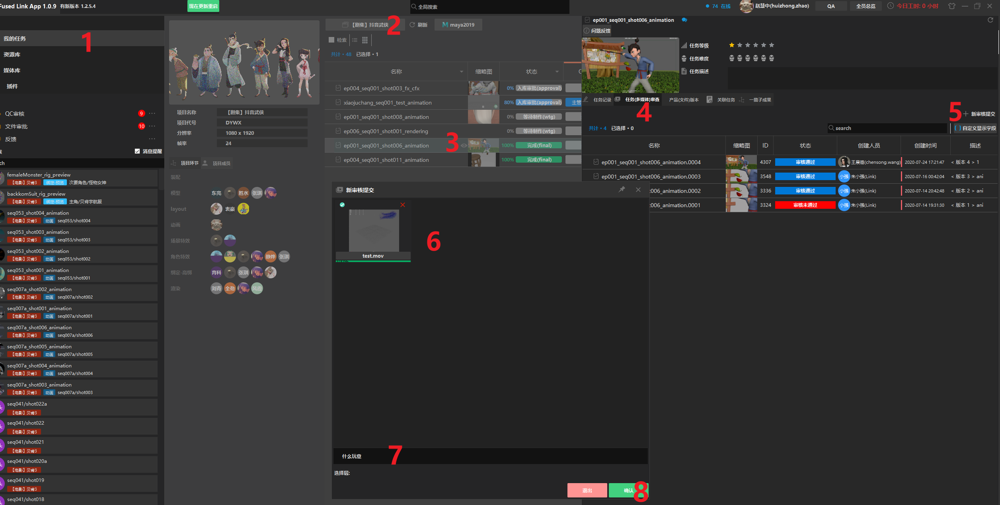
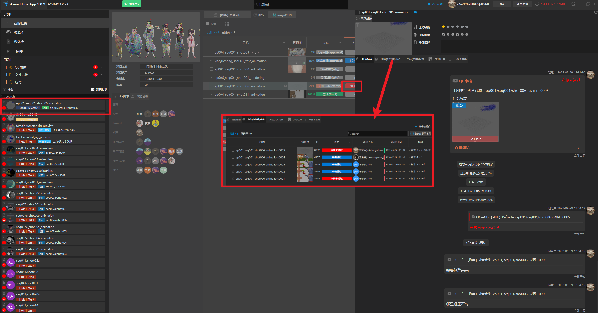
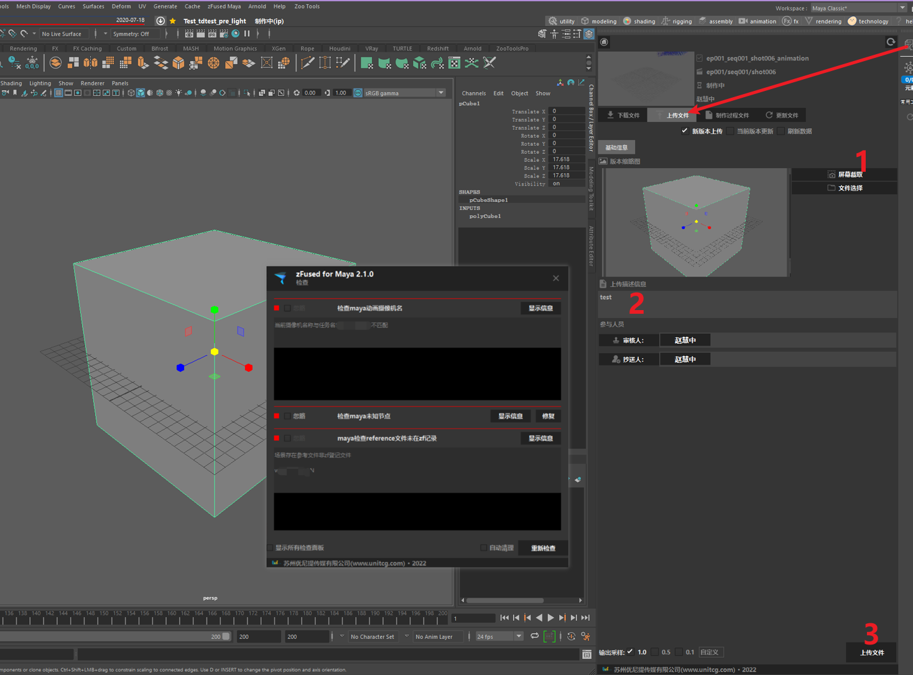

---

## 启动maya
     
  zf界面`我的任务`中，切换对应任务的项目，点击maya启动  
   
   

---

## 资产领取（手动）
  
+ 领取上游环节的成果文件：  

   `utility` > `资产管理` / `场景装配管理` / `镜头管理` （根据所需）  
 
+ 领取当前环节之前版本的过程文件：  
    
    `utility` > `任务管理` （资产和镜头都在里面）
   
   

---

## 上游文件领取（自动）

（以后期预渲染任务为例）

**1.  前提：制片要分配好对应任务**  
   
   

**2. 在`utility` > `我的任务`（图中右上角箭头起始处图标为快捷入口）中找到当前制作的任务**  （如果找不到任务可能是任务状态不对，应该改成制作中）

   

**3. 按图片步骤，勾选首次领取 （不勾选领的是当前环节文件） 、选择无版本、点击领取文件，即可显示当前预渲染任务上游的layout文件并领取**

   

**4. 可以看到领取到的文件渲染路径和分辨率已经设置好**

   

---

## 视频审核发布
+  **上传图片或视频给主管、导演审核效果**

   
+  **在对应任务的QC审核一栏可以看到通过与否**
+  **双击任务或单击小眼睛进入任务详情，`任务记录栏`可以看到发布信息和主管导演们的修改意见，`任务审查栏`可以看到所有提交的历史版本**

   

---

## 文件审核发布
+  **效果审核通过后，需要上传文件供下游环节使用**
> 如果弹出了检查面板(如下图)，说明文件未通过zf检查程序，这时候需要根据检查信息更改错误  
> - 部分检查可以点击`修复`自动修复，其余需人为判断
> - 部分检查根据情况需要可选择`忽略`
> - 点击信息中显示的节点名可以在maya中选中该节点方便纠错
> - 更改完成后点击重新检查,如果没有再弹出检查面板说明检查已通过，这时候再点击上传文件即可  
>
> 如果还是没能成功上传，请先自行检查`模型是否有重名`以及文件中是否含`中文路径文件引用`   
>
> 如果还是传不上，请打开脚本编辑器（右下角带`{;}`图案的白色方块 ），截图给项目TD协助处理
   
   
  
