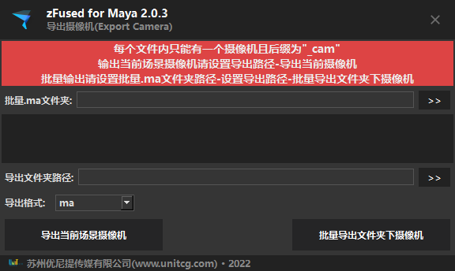

批量导出摄像机文件,支持格式 `ma` `mb` `fbx` `alembic`

## 启动插件
- 菜单启动 
    `zfused_maya` > `animation` > `batch export camera`
- 代码启动
    ```python
    from zcore import reload
    from zfused_maya.tool.animation import export_camera
    reload(export_camera)
    window = export_camera.ExportCamera()
    window.show()
    ```

## UI
