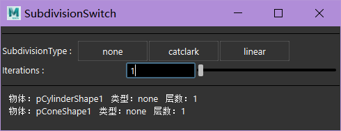

### 启动插件
- 菜单启动 
    `zfused_maya` > `modeling` > `arnold subdivision set`
- 代码启动
    ```python
    from zcore import reload
    import zfused_maya.tool.modeling.arnold_subdivision_set as arnold_subdivision_set
    reload(arnold_subdivision_set)
    arnold_subdivision_set.UI()
    ```

### UI


### 使用方法
1. 选择模型，UI下方会显示所选物体的arnold细分信息
2. 按需要更改`SubdivisionTy`(细分类型)和`Iterations`(细分层数)
   （细分类型为`none`时物体无细分）