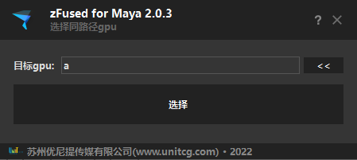

依照已有的`gpu`节点，选择同源的`gpu`节点

## 启动插件
- 菜单启动 
    `zfused_maya` > `modeling` > `select cognate_gpu`
- 代码启动
    ```python
    from zcore import reload
    import zfused_maya.tool.modeling.sel_cognate_gpu as sel_cognate_gpu
    reload(sel_cognate_gpu)
    sel_cognate_gpu.run()
    ```

## UI


## 使用方法
1. 选择目标gpu点击`<<` / 手动输入gpu名称
2. 点击`选择`