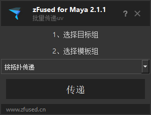

## 启动插件
- 菜单启动 
    `zfused_maya` > `modeling` > `transfer uvs`
- 代码启动
    ```python
    import zfused_maya.tool.modeling.transfer_uvs as transfer_uvs
    reload(transfer_uvs)
    ui = transfer_uvs.Ui()
    ui.show()
    ```
## UI  


## 使用方法  
1. 选择目标组
2. 选择模板组  
3. 点击传递
4. 传递成功后会弹窗提示，若有部分模型未找到对应模板将会弹窗显示未成功的模型路径，并且在视图中高亮选择这些模型  


## 注意
> 在大纲里选择两个组，不要在视图中框选模型