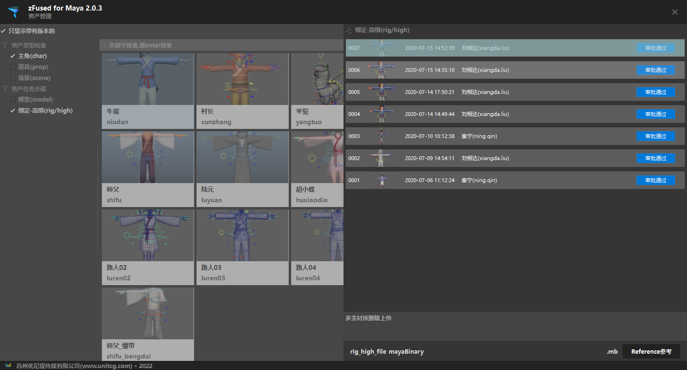

资产文件参考统一化配置系统

## 启动插件
- 菜单启动 
    `zfused_maya` > `utility` > `asset management`
- 代码启动
    ```python
    from zfused_maya.tool.utility import assetmanage
    window = assetmanage.AssetManageWidget()
    window.show()
    ```

## UI
